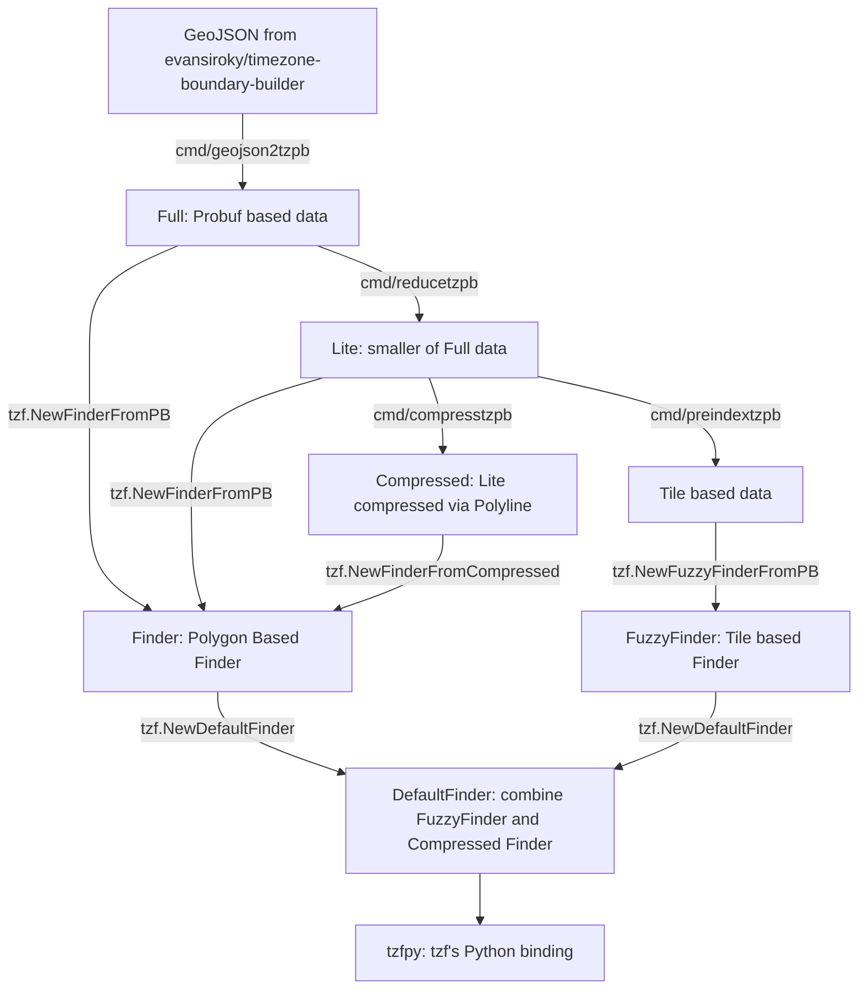

# TZF: a timezone finder for Go&Python. [](https://pkg.go.dev/github.com/ringsaturn/tzf) [](https://pypi.org/project/tzfpy/)


## Quick Start

### Go

```go
package main

import (
	"fmt"

	"github.com/ringsaturn/tzf"
)

func main() {
	finder, err := tzf.NewDefaultFinder()
	if err != nil {
		panic(err)
	}
	fmt.Println(finder.GetTimezoneName(116.6386, 40.0786))
}
```

If you need 100% accurate query result, use below to got a finder:

```go
package main

import (
	"fmt"

	"github.com/ringsaturn/tzf"
	tzfrel "github.com/ringsaturn/tzf-rel"
	"github.com/ringsaturn/tzf/pb"
	"google.golang.org/protobuf/proto"
)

func main() {
	input := &pb.Timezones{}

	// Full data, about 83.5MB
	dataFile := tzfrel.FullData

	if err := proto.Unmarshal(dataFile, input); err != nil {
		panic(err)
	}
	finder, _ := tzf.NewFinderFromPB(input)
	fmt.Println(finder.GetTimezoneName(116.6386, 40.0786))
}
```

### Python

```console
pip install tzfpy
```

```py
>>> from tzfpy import get_tz
>>> print(get_tz(121.4737, 31.2305))
Asia/Shanghai
```

Python binding source codes: <https://github.com/ringsaturn/tzf/tree/main/python>

### CLI Tool

```bash
go install github.com/ringsaturn/tzf/cmd/tzf@latest
tzf -lng 116.3883 -lat 39.9289
```

## Data

Original data download from <https://github.com/evansiroky/timezone-boundary-builder>.

Preprocessed probuf data can get from <https://github.com/ringsaturn/tzf-rel> which has Go's `embed` support.

tzf's data pipleine can de drawed as:



The [full data(~80MB)][full-link] could work anywhere but requires more memory usage.

The [lite data(~10MB)][lite-link] doesn't work well in some edge places.

You can see points that results diff in this [page][points_not_equal].

If a little longer init time is acceptable,
the [compressed data(~5MB)][compressd-link] which come from lite data
will be more friendly for binary distribution.

The [preindex data(~1.78MB)][preindex-link] are many tiles.
It's used inside the `DefaultFinder`, which built on `FuzzyFinder`, to reduce
raycasting algorithm execution times.

[full-link]: https://github.com/ringsaturn/tzf-rel/blob/main/combined-with-oceans.pb
[lite-link]: https://github.com/ringsaturn/tzf-rel/blob/main/combined-with-oceans.reduce.pb
[preindex-link]: https://github.com/ringsaturn/tzf-rel/blob/main/combined-with-oceans.reduce.preindex.pb
[compressd-link]: https://github.com/ringsaturn/tzf-rel/blob/main/combined-with-oceans.reduce.compress.pb
[points_not_equal]: https://geojson.io/#id=gist:ringsaturn/2d958e7f0a279a7411c04907f255955a

## Performance

Benchmark run version https://github.com/ringsaturn/tzf/releases/tag/v0.9.0

```
goos: darwin
goarch: amd64
pkg: github.com/ringsaturn/tzf
cpu: Intel(R) Core(TM) i9-9880H CPU @ 2.30GHz
BenchmarkDefaultFinder_GetTimezoneName_Random_WorldCities-16              731966              1737 ns/op
BenchmarkFuzzyFinder_GetTimezoneName_Random_WorldCities-16               1608507               734.9 ns/op
BenchmarkGetTimezoneName-16                                               260023              4646 ns/op
BenchmarkGetTimezoneNameAtEdge-16                                         234446              5178 ns/op
BenchmarkGetTimezoneName_Random_WorldCities-16                            178764              6571 ns/op
BenchmarkFullFinder_GetTimezoneName-16                                    236419              5088 ns/op
BenchmarkFullFinder_GetTimezoneNameAtEdge-16                              225300              5470 ns/op
BenchmarkFullFinder_GetTimezoneName_Random_WorldCities-16                 127683              8070 ns/op
PASS
ok      github.com/ringsaturn/tzf       18.869s
```

- <https://ringsaturn.github.io/tzf/>: Continuous Benchmark Result
- <https://ringsaturn.github.io/tz-benchmark/> Continuous Benchmark Compared with other packages

## Related Repos

- <https://github.com/ringsaturn/tzf-rel>: Preprocessed probuf data release repo
- <https://github.com/ringsaturn/tzf-server>: HTTP Server for debug
- <https://github.com/ringsaturn/tz-benchmark>: Continuous Benchmark Compared with other packages

## Thanks

- <https://github.com/paulmach/orb>
- <https://github.com/tidwall/geojson>
- <https://github.com/jannikmi/timezonefinder>
- <https://github.com/evansiroky/timezone-boundary-builder>
