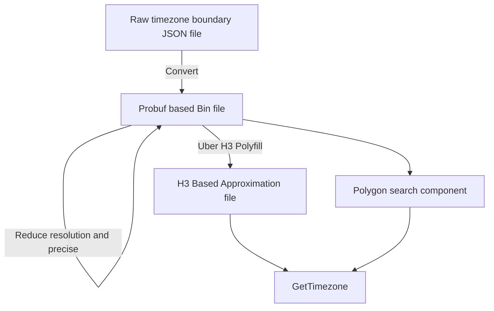

# TZF: a timezone finder for Go.

TODO:

- [x] POC: polygon search based
- [x] Reduce Polygon size option
  - [x] Reduce float precise
  - [x] Reduce line numbers
- [ ] H3 Based Approximation, something like Placekey
