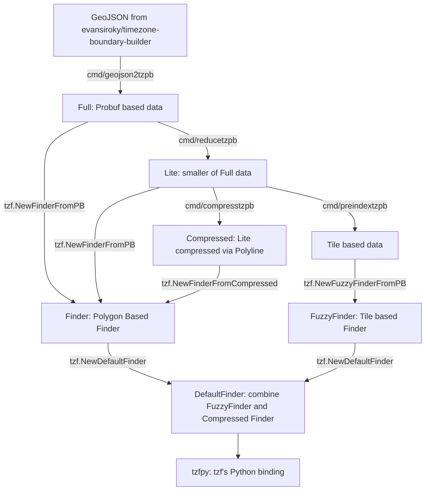

# TZF: a fast timezone finder for Go. [](https://pkg.go.dev/github.com/ringsaturn/tzf)


NOTE: This package is also available in:

- Rust, see [tzf-rs](https://github.com/ringsaturn/tzf-rs).
- Python, see [tzfpy](https://github.com/ringsaturn/tzfpy)

## Quick Start

### Go

```go
// Use about 150MB memory for init, and 60MB after GC.
package main

import (
	"fmt"

	"github.com/ringsaturn/tzf"
)

func main() {
	finder, err := tzf.NewDefaultFinder()
	if err != nil {
		panic(err)
	}
	fmt.Println(finder.GetTimezoneName(116.6386, 40.0786))
}
```

If you need 100% accurate query result, use below to got a finder:

```go
// Use about 900MB memory for init, and 660MB after GC.
package main

import (
	"fmt"

	"github.com/ringsaturn/tzf"
	tzfrel "github.com/ringsaturn/tzf-rel"
	"github.com/ringsaturn/tzf/pb"
	"google.golang.org/protobuf/proto"
)

func main() {
	input := &pb.Timezones{}

	// Full data, about 83.5MB
	dataFile := tzfrel.FullData

	if err := proto.Unmarshal(dataFile, input); err != nil {
		panic(err)
	}
	finder, _ := tzf.NewFinderFromPB(input)
	fmt.Println(finder.GetTimezoneName(116.6386, 40.0786))
}
```

### CLI Tool

```bash
go install github.com/ringsaturn/tzf/cmd/tzf@latest
tzf -lng 116.3883 -lat 39.9289
```

## Data

Original data download from
<https://github.com/evansiroky/timezone-boundary-builder> .

Preprocessed probuf data can get from <https://github.com/ringsaturn/tzf-rel>
which has Go's `embed` support. Those files are Protocol Buffers messages for
more efficiency binary distribution like Python wheels, you can view
the [`pb/tzinfo.proto`](./pb/tzinfo.proto) or it's [HTML format docs][pb_html]
for the internal format info.

tzf's data pipeline can be drew as:



The [full data(~80MB)][full-link] could work anywhere but requires more memory usage.

The [lite data(~10MB)][lite-link] doesn't work well in some edge places.

You can see points that results diff in this [page][points_not_equal].

If a little longer init time is acceptable,
the [compressed data(~5MB)][compressd-link] which come from lite data
will be **more friendly for binary distribution.**

The [preindex data(~1.78MB)][preindex-link] are many tiles.
It's used inside the `DefaultFinder`, which built on `FuzzyFinder`, to reduce
raycasting algorithm execution times.

[pb_html]: https://ringsaturn.github.io/tzf/pb.html
[full-link]: https://github.com/ringsaturn/tzf-rel/blob/main/combined-with-oceans.pb
[lite-link]: https://github.com/ringsaturn/tzf-rel/blob/main/combined-with-oceans.reduce.pb
[preindex-link]: https://github.com/ringsaturn/tzf-rel/blob/main/combined-with-oceans.reduce.preindex.pb
[compressd-link]: https://github.com/ringsaturn/tzf-rel/blob/main/combined-with-oceans.reduce.compress.pb
[points_not_equal]: https://geojson.io/#id=gist:ringsaturn/2d958e7f0a279a7411c04907f255955a

## Performance

Package tzf is designed for high performance geo queries related services like
weather forecast API. And most queries could return in very limited time,
averagely like 2000 nanoseconds.

Here is what have been done for performance improvements:

1. Use preindexes to handle most queries, basically about 1000 nanoseconds
2. Use RTree to filter candidate polygons instead of iter all polygons to reduce
   Ray Casting algorithm execution times
3. Use a fine tuned Ray Casting algorithm package
   <https://github.com/tidwall/geojson> to check if polygon contain point

That's all. There is no black magics inside package tzf.

Benchmark run version <https://github.com/ringsaturn/tzf/releases/tag/v0.10.0>

```
goos: darwin
goarch: amd64
pkg: github.com/ringsaturn/tzf
cpu: Intel(R) Core(TM) i9-9880H CPU @ 2.30GHz
BenchmarkDefaultFinder_GetTimezoneName_Random_WorldCities-16              441309              2778 ns/op              1000 ns/p50            10000 ns/p90            19000 ns/p99
BenchmarkFuzzyFinder_GetTimezoneName_Random_WorldCities-16               1000000              1077 ns/op              1000 ns/p50             2000 ns/p90             2000 ns/p99
BenchmarkGetTimezoneName-16                                               226834              5190 ns/op              5000 ns/p50             5000 ns/p90            22000 ns/p99
BenchmarkGetTimezoneNameAtEdge-16                                         211555              5606 ns/op              5000 ns/p50             6000 ns/p90            23000 ns/p99
BenchmarkGetTimezoneName_Random_WorldCities-16                            163000              7279 ns/op              7000 ns/p50            10000 ns/p90            29000 ns/p99
BenchmarkFullFinder_GetTimezoneName-16                                    212896              5556 ns/op              5000 ns/p50             6000 ns/p90            22000 ns/p99
BenchmarkFullFinder_GetTimezoneNameAtEdge-16                              195381              6262 ns/op              6000 ns/p50             7000 ns/p90            23000 ns/p99
BenchmarkFullFinder_GetTimezoneName_Random_WorldCities-16                 116652              9354 ns/op              8000 ns/p50            15000 ns/p90            31000 ns/p99
PASS
ok      github.com/ringsaturn/tzf       18.321s
```

- <https://ringsaturn.github.io/tzf/>:
  Continuous Benchmark Result
- <https://ringsaturn.github.io/tz-benchmark/>
  Continuous Benchmark Compared with other packages

## Related Repos

- <https://github.com/ringsaturn/tzf-rel>
  Preprocessed probuf data release repo
- <https://github.com/ringsaturn/tzf-server>
  HTTP Server for debug
- <https://github.com/ringsaturn/tz-benchmark>
  Continuous Benchmark Compared with other packages
- <https://github.com/ringsaturn/tzf-rs>
  Rust port of tzf
- <https://github.com/ringsaturn/tzfpy>
  Rust port's Python binding

## Thanks

- <https://github.com/paulmach/orb>
- <https://github.com/tidwall/geojson>
- <https://github.com/jannikmi/timezonefinder>
- <https://github.com/evansiroky/timezone-boundary-builder>
