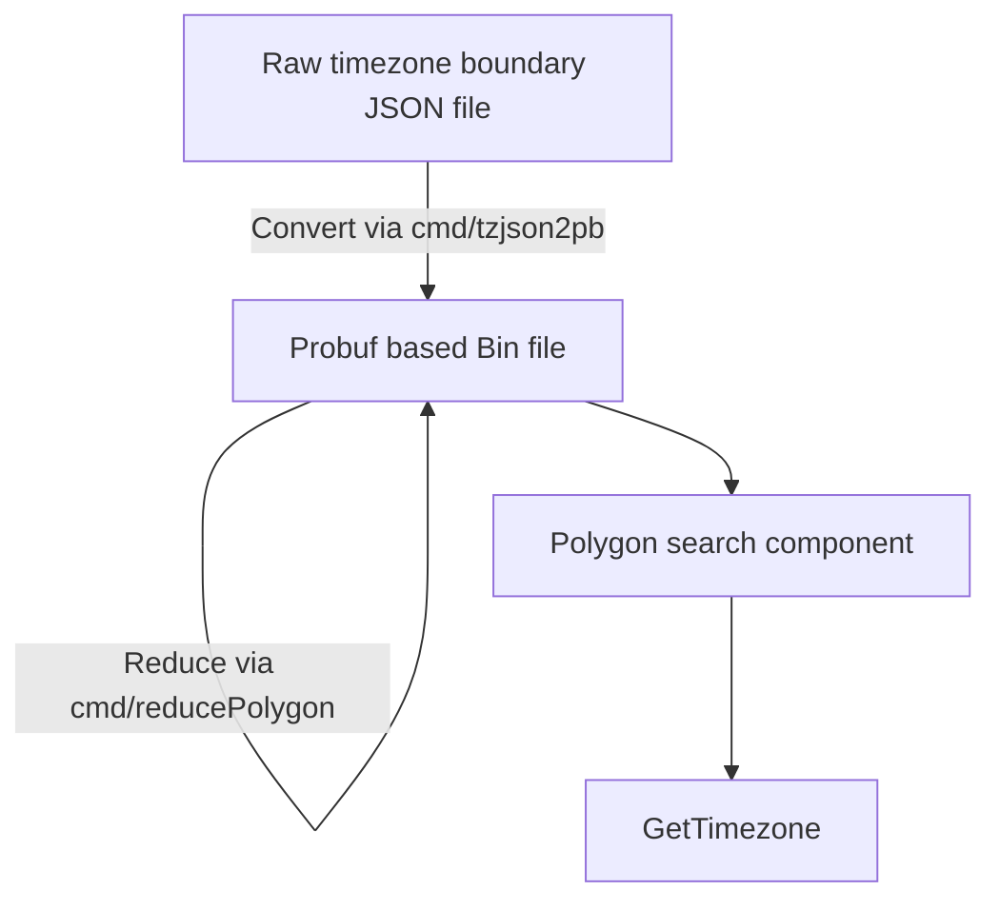

# TZF: a timezone finder for Go.



## Quick Start

```go
package main

import (
	"fmt"

	"github.com/ringsaturn/tzf"
	tzfrel "github.com/ringsaturn/tzf-rel"
	"github.com/ringsaturn/tzf/pb"
	"google.golang.org/protobuf/proto"
)

func main() {
	input := &pb.Timezones{}

	// Lite data, about 16.7MB
	dataFile := tzfrel.LiteData

	// Full data, about 83.5MB
	// dataFile := tzfrel.FullData

	if err := proto.Unmarshal(dataFile, input); err != nil {
		panic(err)
	}
	finder, _ := tzf.NewFinderFromPB(input)
	fmt.Println(finder.GetTimezoneName(111.8674, 34.4200))
	fmt.Println(finder.GetTimezoneName(-97.8674, 34.4200))
	fmt.Println(finder.GetTimezoneName(121.3547, 31.1139))
	fmt.Println(finder.GetTimezoneName(139.4382, 36.4432))
	fmt.Println(finder.GetTimezoneName(24.5212, 50.2506))
	fmt.Println(finder.GetTimezoneName(-0.9671, 52.0152))
	fmt.Println(finder.GetTimezoneName(-4.5706, 46.2747))
	fmt.Println(finder.GetTimezoneName(111.9781, 45.0182))
	fmt.Println(finder.GetTimezoneName(-73.7729, 38.3530))
}
```

Output:

```
Asia/Shanghai
America/Chicago
Asia/Shanghai
Asia/Tokyo
Europe/Kiev
Europe/London
Etc/GMT
Asia/Shanghai
Etc/GMT+5
```

## Data

Original data download from <https://github.com/evansiroky/timezone-boundary-builder>.

Preprocessed probuf data can get from <https://github.com/ringsaturn/tzf-rel> which has Go's `embed` support.

## TODO

- [x] POC: polygon search based
- [x] Reduce Polygon size option
  - [x] Reduce float precise
  - [x] Reduce line numbers
- [ ] H3 Based Approximation, something like Placekey

## Related Links

- <https://ringsaturn.github.io/tzf/>: Continuous Benchmark Result
- <https://github.com/ringsaturn/tzf-rel>: Preprocessed probuf data release repo
- <https://github.com/ringsaturn/tzf-server>: HTTP Server for debug

## Thanks

- <https://github.com/tidwall/geojson>
- <https://github.com/jannikmi/timezonefinder>
- <https://github.com/evansiroky/timezone-boundary-builder>
