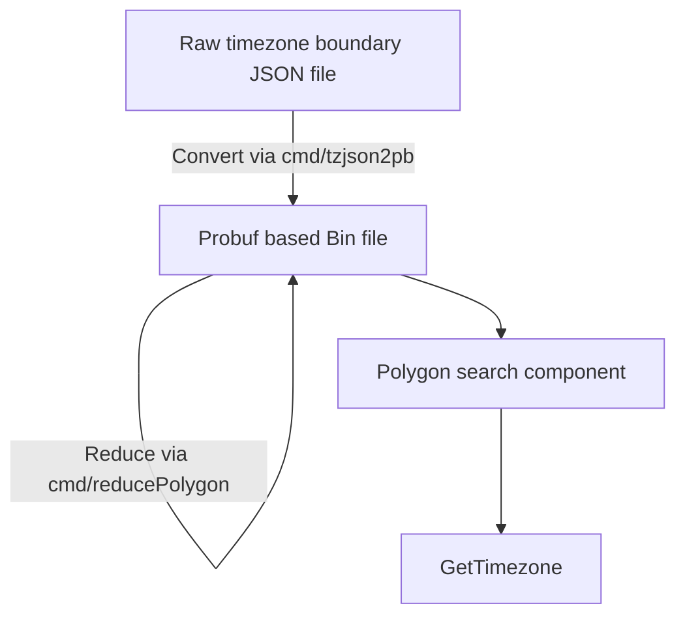

# TZF: a timezone finder for Go&Python. [](https://pkg.go.dev/github.com/ringsaturn/tzf) [](https://pypi.org/project/tzfpy/)


## Quick Start

### Go

```go
package main

import (
	"fmt"

	"github.com/ringsaturn/tzf"
	tzfrel "github.com/ringsaturn/tzf-rel"
	"github.com/ringsaturn/tzf/pb"
	"google.golang.org/protobuf/proto"
)

func main() {
	input := &pb.Timezones{}

	// Lite data, about 11MB
	dataFile := tzfrel.LiteData

	// Full data, about 83.5MB
	// dataFile := tzfrel.FullData

	if err := proto.Unmarshal(dataFile, input); err != nil {
		panic(err)
	}
	finder, _ := tzf.NewFinderFromPB(input)
	fmt.Println(finder.GetTimezoneName(111.8674, 34.4200))
	fmt.Println(finder.GetTimezoneName(-97.8674, 34.4200))
	fmt.Println(finder.GetTimezoneName(121.3547, 31.1139))
	fmt.Println(finder.GetTimezoneName(139.4382, 36.4432))
	fmt.Println(finder.GetTimezoneName(24.5212, 50.2506))
	fmt.Println(finder.GetTimezoneName(-0.9671, 52.0152))
	fmt.Println(finder.GetTimezoneName(-4.5706, 46.2747))
	fmt.Println(finder.GetTimezoneName(111.9781, 45.0182))
	fmt.Println(finder.GetTimezoneName(-73.7729, 38.3530))
}
```

Output:

```
Asia/Shanghai
America/Chicago
Asia/Shanghai
Asia/Tokyo
Europe/Kiev
Europe/London
Etc/GMT
Asia/Shanghai
Etc/GMT+5
```

### Python

Check <https://github.com/ringsaturn/tzf/tree/main/python>

## Data

Original data download from <https://github.com/evansiroky/timezone-boundary-builder>.

Preprocessed probuf data can get from <https://github.com/ringsaturn/tzf-rel> which has Go's `embed` support.



### Which dataset should I use

The [full data(~80MB)][full-link] could work anywhere but requires more memory usage.

The [lite data(~10MB)][lite-link] doesn't work well in some edge places.

You can see ranges that results diff in this [gist][points_not_equal].

If a little longer init time is acceptable,
the compressed data(~5MB) which come from lite data
will be more friendly for binary distribution.

[full-link]: https://github.com/ringsaturn/tzf-rel/blob/main/combined-with-oceans.pb
[lite-link]: https://github.com/ringsaturn/tzf-rel/blob/main/combined-with-oceans.reduce.pb
[compressd-link]: https://github.com/ringsaturn/tzf-rel/blob/main/combined-with-oceans.reduce.compress.pb
[points_not_equal]: https://gist.github.com/ringsaturn/8e1614146127cb25bf4d1325df347d22

## Related Links

- <https://ringsaturn.github.io/tzf/>: Continuous Benchmark Result
  - <https://ringsaturn.github.io/tz-benchmark/> Continuous Benchmark Compared with other packages
- <https://github.com/ringsaturn/tzf-rel>: Preprocessed probuf data release repo
- <https://github.com/ringsaturn/tzf-server>: HTTP Server for debug

## Thanks

- <https://github.com/paulmach/orb>
- <https://github.com/tidwall/geojson>
- <https://github.com/jannikmi/timezonefinder>
- <https://github.com/evansiroky/timezone-boundary-builder>
