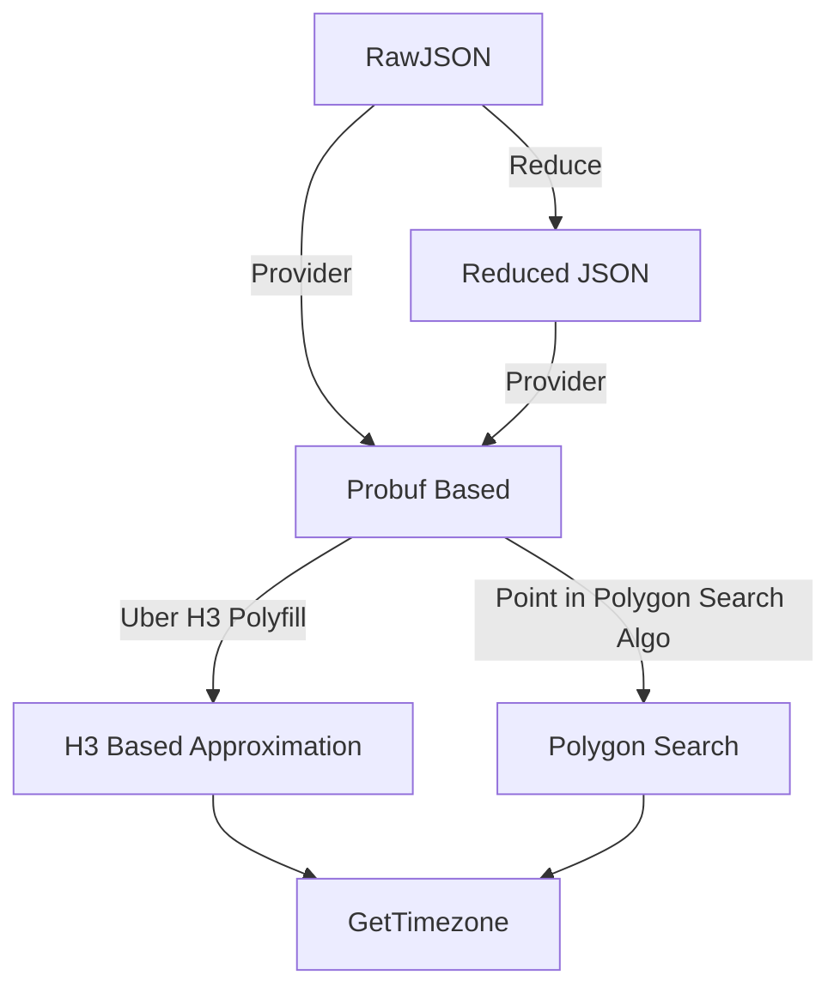

# TZF: a timezone finder for Go.

TODO:

- [ ] POC: polygon search based
- [ ] Reduce Polygon size option
  - [ ] Reduce float precise
  - [ ] Reduce line numbers
- [ ] H3 Based Approximation, something like Placekey
