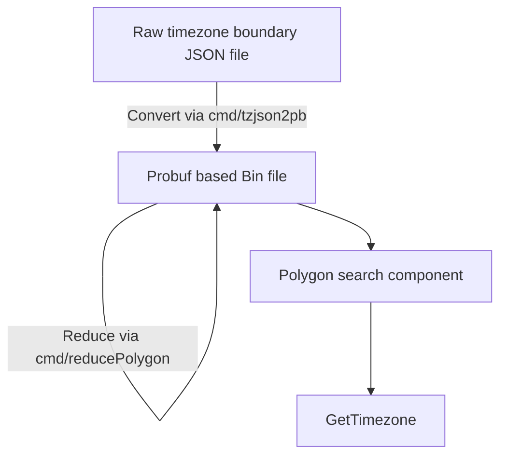

# TZF: a timezone finder for Go&Python. [](https://pkg.go.dev/github.com/ringsaturn/tzf) [](https://pypi.org/project/tzfpy/)


## Quick Start

### Go

<table>
<tbody>
<tr>
<td colspan="2">

```go
import (
	"fmt"

	"github.com/ringsaturn/tzf"
	tzfrel "github.com/ringsaturn/tzf-rel"
	"github.com/ringsaturn/tzf/pb"
	"google.golang.org/protobuf/proto"
)
```

</td>

<tr>
<td>

#### Use lite/full data

The [full data(~80MB)][full-link] could work anywhere but requires more memory usage.
The [lite data(~10MB)][lite-link] doesn't work well in some edge places.
You can see ranges that results diff in this [gist][points_not_equal].

[full-link]: https://github.com/ringsaturn/tzf-rel/blob/main/combined-with-oceans.pb
[lite-link]: https://github.com/ringsaturn/tzf-rel/blob/main/combined-with-oceans.reduce.pb
[points_not_equal]: https://gist.github.com/ringsaturn/8e1614146127cb25bf4d1325df347d22


</td>
<td>

#### Use compress data

If a little longer init time is acceptable,
the [compressed data(~5MB)][compressd-link] which come from lite data
will be more friendly for binary distribution.

[compressd-link]: https://github.com/ringsaturn/tzf-rel/blob/main/combined-with-oceans.reduce.compress.pb

</td>
</tr>

</tr>
<tr>
<td>

```go
input := &pb.Timezones{}

// Lite data, about 10MB
dataFile := tzfrel.LiteData

// Full data, about 80MB
// dataFile := tzfrel.FullData

err := proto.Unmarshal(dataFile, input)
if err != nil {
	panic(err)
}
finder, err := tzf.NewFinderFromPB(input)
if err != nil {
	panic(err)
}
```

</td>
<td>

```go
input := &pb.CompressedTimezones{}

// Compress data, about 5MB
dataFile := tzfrel.LiteCompressData

err := proto.Unmarshal(dataFile, input)
if err != nil {
	panic(err)
}
finder, err := tzf.NewFinderFromCompressed(input)
if err != nil {
	panic(err)
}
```

</td>
</tr>
<tr>
<td colspan="2">

```go
fmt.Println(finder.GetTimezoneName(111.8674, 34.4200)) // Output: Asia/Shanghai
fmt.Println(finder.GetTimezoneName(-97.8674, 34.4200)) // Output: America/Chicago
fmt.Println(finder.GetTimezoneName(121.3547, 31.1139)) // Output: Asia/Shanghai
fmt.Println(finder.GetTimezoneName(139.4382, 36.4432)) // Output: Asia/Tokyo
fmt.Println(finder.GetTimezoneName(24.5212, 50.2506))  // Output: Europe/Kyiv
fmt.Println(finder.GetTimezoneName(-0.9671, 52.0152))  // Output: Europe/London
fmt.Println(finder.GetTimezoneName(-4.5706, 46.2747))  // Output: Etc/GMT
fmt.Println(finder.GetTimezoneName(111.9781, 45.0182)) // Output: Asia/Shanghai
fmt.Println(finder.GetTimezoneName(-73.7729, 38.3530)) // Output: Etc/GMT+5
fmt.Println(finder.GetTimezoneName(114.1594, 22.3173)) // Output: Asia/Hong_Kong
```

</td>
</tr>
</tbody>
</table>

#### Which dataset should I use


### Python

```console
pip install tzfpy
```

```py
>>> from tzfpy import get_tz
>>> print(get_tz(121.4737, 31.2305))
Asia/Shanghai
```

Python binding source codes: <https://github.com/ringsaturn/tzf/tree/main/python>

## Data

Original data download from <https://github.com/evansiroky/timezone-boundary-builder>.

Preprocessed probuf data can get from <https://github.com/ringsaturn/tzf-rel> which has Go's `embed` support.



## Related Links

- <https://ringsaturn.github.io/tzf/>: Continuous Benchmark Result
  - <https://ringsaturn.github.io/tz-benchmark/> Continuous Benchmark Compared with other packages
- <https://github.com/ringsaturn/tzf-rel>: Preprocessed probuf data release repo
- <https://github.com/ringsaturn/tzf-server>: HTTP Server for debug

## Thanks

- <https://github.com/paulmach/orb>
- <https://github.com/tidwall/geojson>
- <https://github.com/jannikmi/timezonefinder>
- <https://github.com/evansiroky/timezone-boundary-builder>
