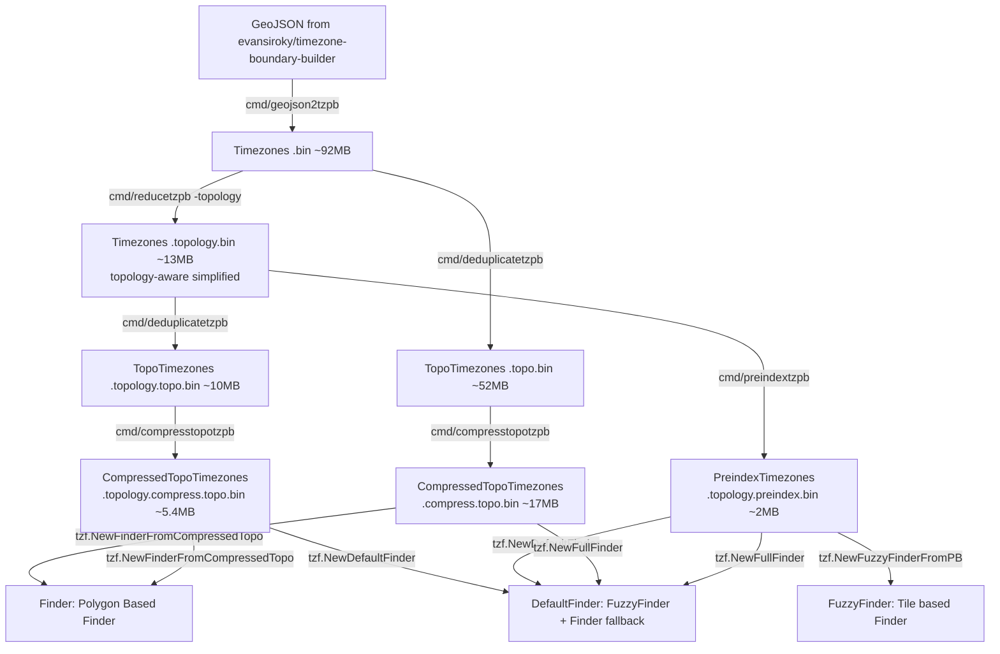

# tzf: a fast timezone finder for Go. [](https://pkg.go.dev/github.com/ringsaturn/tzf) [](https://codecov.io/gh/ringsaturn/tzf) [](https://app.fossa.com/projects/git%2Bgithub.com%2Fringsaturn%2Ftzf?ref=badge_shield)


- Released documentation: <https://pkg.go.dev/github.com/ringsaturn/tzf>
- Try it online: [tzf-web](https://ringsaturn.github.io/tzf-web/)

## Quick Start

Install via:

```bash
go get github.com/ringsaturn/tzf
```

> [!NOTE]
>
> This `NewDefaultFinder` uses simplified shape data so it is not entirely
> accurate around the border.

It's expensive to init tzf's Finder/FuzzyFinder/DefaultFinder, please consider
reuse it or as a global var. Below is a global var example:

```go
package main

import (
	"fmt"

	"github.com/ringsaturn/tzf"
)

var f tzf.F

func init() {
	var err error
	f, err = tzf.NewDefaultFinder()
	if err != nil {
		panic(err)
	}
}

func main() {
	// In longitude-latitude order
	fmt.Println(f.GetTimezoneName(116.3883, 39.9289))
	fmt.Println(f.GetTimezoneName(-73.935242, 40.730610))
}
```

### Best Practice: Setup 100% Accuracy via `NewFullFinder`

If you require a query result that is 100% accurate, use the following to
locate(also, **reuse it when possible**):

```go
package main

import (
	"fmt"

	"github.com/ringsaturn/tzf"
)

func main() {
	finder, err := tzf.NewFullFinder()
	if err != nil {
		panic(err)
	}

	fmt.Println(finder.GetTimezoneName(139.6917, 35.6895))
}
```

Please note that `NewFullFinder()` is more expensive to init and has higher
memory usage than `NewDefaultFinder()`, but it provides 100% accuracy.

See the [Performance](#performance) section for more details.

## CLI Tool

In addition to using tzf as a library in your Go projects, you can also use the
tzf command-line interface (CLI) tool to quickly get the timezone name for a set
of coordinates. To use the CLI tool, you first need to install it using the
following command:

```bash
go install github.com/ringsaturn/tzf/cmd/tzf@latest
```

Once installed, you can use the tzf command followed by the latitude and
longitude values to get the timezone name:

```bash
tzf -lng 116.3883 -lat 39.9289
```

Alternatively if you want to look up multiple coordinates efficiently you can
specify the ordering and pipe them to the tzf command one pair of coordinates
per line:

```bash
echo -e "116.3883 39.9289\n116.3883, 39.9289" | tzf -stdin-order lng-lat
```

## Data

You can download the original data from
<https://github.com/evansiroky/timezone-boundary-builder>.

The preprocessed protobuf data can be obtained from
<https://github.com/ringsaturn/tzf-dist>, which has Go's `embedded` support.
These files are Protocol Buffers messages for more efficient binary
distribution. You can view the [`pb/tzinfo.proto file`](./pb/tzinfo.proto) or
its [HTML format documentation][pb_html] for information about the internal
format.

The data pipeline for tzf can be illustrated as follows:


```mermaid
graph TD
    Raw[GeoJSON from evansiroky/timezone-boundary-builder]
    Full[Timezones .bin ~92MB]
    Simplified[Timezones .topology.bin ~13MB<br/>topology-aware simplified]
    SimplifiedTopo[TopoTimezones .topology.topo.bin ~10MB]
    FullTopo[TopoTimezones .topo.bin ~52MB]
    SimplifiedCompressTopo[CompressedTopoTimezones<br/>.topology.compress.topo.bin ~5.4MB]
    FullCompressTopo[CompressedTopoTimezones<br/>.compress.topo.bin ~17MB]
    Preindex[PreindexTimezones<br/>.topology.preindex.bin ~2MB]

    Finder[Finder: Polygon Based Finder]
    FuzzyFinder[FuzzyFinder: Tile based Finder]
    DefaultFinder[DefaultFinder: FuzzyFinder + Finder fallback]

    Raw --> |cmd/geojson2tzpb|Full
    Full --> |cmd/reducetzpb -topology|Simplified
    Full --> |cmd/deduplicatetzpb|FullTopo
    FullTopo --> |cmd/compresstopotzpb|FullCompressTopo
    Simplified --> |cmd/deduplicatetzpb|SimplifiedTopo
    SimplifiedTopo --> |cmd/compresstopotzpb|SimplifiedCompressTopo
    Simplified --> |cmd/preindextzpb|Preindex

    FullCompressTopo --> |tzf.NewFinderFromCompressedTopo|Finder
    SimplifiedCompressTopo --> |tzf.NewFinderFromCompressedTopo|Finder
    Preindex --> |tzf.NewFuzzyFinderFromPB|FuzzyFinder
    SimplifiedCompressTopo --> |tzf.NewDefaultFinder|DefaultFinder
    Preindex --> |tzf.NewDefaultFinder|DefaultFinder
    FullCompressTopo --> |tzf.NewFullFinder|DefaultFinder
    Preindex --> |tzf.NewFullFinder|DefaultFinder
```

The [combined-with-oceans.compress.topo.bin] (~17MB) preserves full geometric
precision with shared-edge deduplication and polyline compression. Use
`NewFullFinder()` to load it.

The [combined-with-oceans.topology.compress.topo.bin] (~5.4MB) applies
topology-aware Douglas-Peucker simplification (86% point reduction) before
deduplication and compression. It is used by the default `NewDefaultFinder()`
and may not be perfectly accurate at some border areas.

The [combined-with-oceans.topology.preindex.bin] (~2MB) consists of multiple map
tiles and is used within both `DefaultFinder` and `FullFinder` as the fast-path
`FuzzyFinder`, handling most queries without polygon ray-casting.

[pb_html]: https://ringsaturn.github.io/tzf/pb.html
[combined-with-oceans.compress.topo.bin]: https://github.com/ringsaturn/tzf-dist/blob/data/combined-with-oceans.compress.topo.bin
[combined-with-oceans.topology.compress.topo.bin]: https://github.com/ringsaturn/tzf-dist/blob/data/combined-with-oceans.topology.compress.topo.bin
[combined-with-oceans.topology.preindex.bin]: https://github.com/ringsaturn/tzf-dist/blob/data/combined-with-oceans.topology.preindex.bin

I have written an article about the history of tzf, its Rust port, and its Rust
port's Python binding; you can view it
[here](https://blog.ringsaturn.me/en/posts/2023-01-31-history-of-tzf/).

## Performance

The tzf package is intended for high-performance geospatial query backend
services, such as weather forecasting APIs. Most queries can be returned within
a very short time, averaging around 1000 nanoseconds.

Here is what has been done to improve performance:

1. Using the simplified dataset by default.
2. Using pre-indexing to handle most queries takes approximately 500
   nanoseconds.
3. Using the internal `geom` package(fork of
   [geojson](https://github.com/tidwall/geojson)) with a YStripes index
   (inspired by Josh Baker's [`tg`](https://github.com/tidwall/tg)'s ) to verify
   whether a polygon contains a point. Also a grid-index to quickly find
   candidate polygons, inspired Aaron Roney's
   [rtz](https://github.com/twitchax/rtz).

That's all. There are no black magic tricks inside the tzf package.

Below is a benchmark run on my MacBook Pro with Apple M3 Max:

| Target        | Dataset                            | Scenario                               | Median (ns) | p99 (ns) | Approx throughput (ops/s) | Memory (MiB) |
| ------------- | ---------------------------------- | -------------------------------------- | ----------: | -------: | ------------------------: | -----------: |
| DefaultFinder | topology-simplified + preindex     | edge case · GetTimezoneName            |       500.0 |   1250.0 |                   1694.9K |        74.90 |
| FuzzyFinder   | preindex                           | edge case · GetTimezoneName            |       250.0 |    375.0 |                   3521.1K |         2.40 |
| Finder        | topology-simplified                | edge case · GetTimezoneName            |       250.0 |    875.0 |                   3022.1K |        72.70 |
| FullFinder    | full-precision + preindex          | edge case · GetTimezoneName            |       542.0 |   1375.0 |                   1586.3K |       422.90 |
| Finder        | full-precision                     | edge case · GetTimezoneName            |       292.0 |   1167.0 |                   2678.1K |       420.70 |
| DefaultFinder | topology-simplified + preindex     | random world cities · GetTimezoneName  |       167.0 |    791.0 |                   3855.1K |        74.90 |
| FuzzyFinder   | preindex                           | random world cities · GetTimezoneName  |       167.0 |    333.0 |                   4608.3K |         2.40 |
| Finder        | topology-simplified                | random world cities · GetTimezoneName  |       209.0 |   1250.0 |                   3076.0K |        72.70 |
| FullFinder    | full-precision + preindex          | random world cities · GetTimezoneName  |       208.0 |    917.0 |                   3527.3K |       422.90 |
| Finder        | full-precision                     | random world cities · GetTimezoneName  |       250.0 |   1167.0 |                   2953.3K |       420.70 |
| Finder        | topology-simplified + GridIndex    | random world cities · GetTimezoneName  |       209.0 |   1167.0 |                   3202.0K |        72.70 |
| Finder        | topology-simplified (no GridIndex) | random world cities · GetTimezoneName  |      1833.0 |   2875.0 |                    612.4K |        67.00 |
| DefaultFinder | topology-simplified + preindex     | random world cities · GetTimezoneNames |       416.0 |   1375.0 |                   1956.9K |        74.90 |
| FuzzyFinder   | preindex                           | random world cities · GetTimezoneNames |       208.0 |    334.0 |                   4347.8K |         2.40 |
| Finder        | topology-simplified                | random world cities · GetTimezoneNames |       417.0 |   1375.0 |                   1931.2K |        72.70 |
| FullFinder    | full-precision + preindex          | random world cities · GetTimezoneNames |       459.0 |   1750.0 |                   1623.1K |       422.90 |

- <https://ringsaturn.github.io/tz-benchmark/> displays a continuous benchmark
  comparison with other packages.

## Related Repos

| Language or Sever         | Link                                                                    | Note                |
| ------------------------- | ----------------------------------------------------------------------- | ------------------- |
| Go                        | [`ringsaturn/tzf`](https://github.com/ringsaturn/tzf)                   |                     |
| Ruby                      | [`HarlemSquirrel/tzf-rb`](https://github.com/HarlemSquirrel/tzf-rb)     | build with tzf-rs   |
| Rust                      | [`ringsaturn/tzf-rs`](https://github.com/ringsaturn/tzf-rs)             |                     |
| Swift                     | [`ringsaturn/tzf-swift`](https://github.com/ringsaturn/tzf-swift)       |                     |
| Python                    | [`ringsaturn/tzfpy`](https://github.com/ringsaturn/tzfpy)               | build with tzf-rs   |
| HTTP API                  | [`racemap/rust-tz-service`](https://github.com/racemap/rust-tz-service) | build with tzf-rs   |
| JS via Wasm(browser only) | [`ringsaturn/tzf-wasm`](https://github.com/ringsaturn/tzf-wasm)         | build with tzf-rs   |
| Online                    | [`ringsaturn/tzf-web`](https://github.com/ringsaturn/tzf-web)           | build with tzf-wasm |

See [Project tzf](https://project-tzf.ringsaturn.me/docs/getting-started/) for
more information.

## Thanks

- <https://github.com/paulmach/orb>
- <https://github.com/tidwall/geojson>
- <https://github.com/tidwall/tg>
- <https://github.com/jannikmi/timezonefinder>
- <https://github.com/evansiroky/timezone-boundary-builder>
- And other projects listed in [NOTICE](./NOTICE)

## LICENSE

This project is licensed under the [MIT license](./LICENSE) and
[Anti CSDN License](./LICENSE_ANTI_CSDN.md)[^anti_csdn]. The data is licensed
under the
[ODbL license](https://github.com/ringsaturn/tzf-dist/blob/main/LICENSE_DATA),
same as
[`evansiroky/timezone-boundary-builder`](https://github.com/evansiroky/timezone-boundary-builder)

[^anti_csdn]:
    This license is to prevent the use of this project by CSDN, has no
    effect on other use cases.

[](https://app.fossa.com/projects/git%2Bgithub.com%2Fringsaturn%2Ftzf?ref=badge_large)
