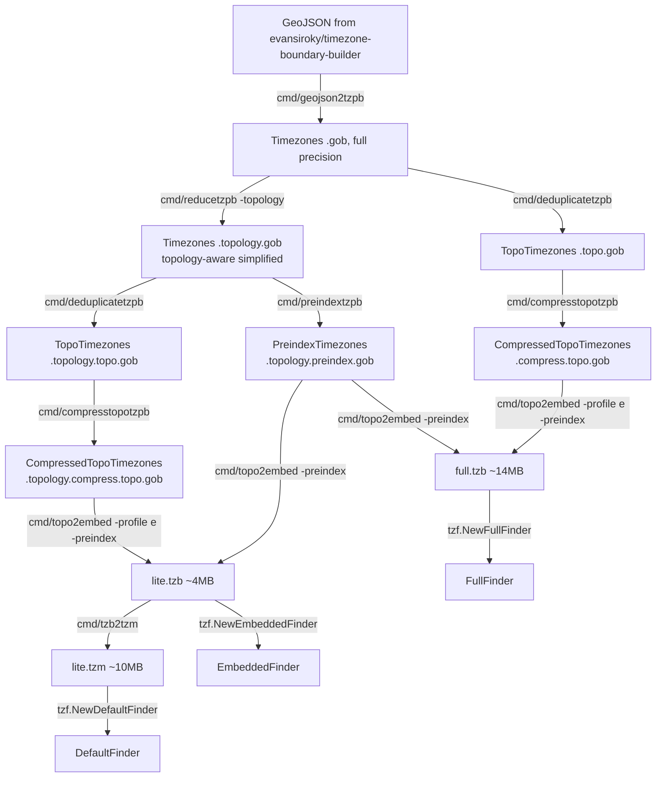

# tzf: a fast timezone finder for Go. [](https://pkg.go.dev/github.com/ringsaturn/tzf/v2) [](https://codecov.io/gh/ringsaturn/tzf) [](https://app.fossa.com/projects/git%2Bgithub.com%2Fringsaturn%2Ftzf?ref=badge_shield)


- Released documentation: <https://pkg.go.dev/github.com/ringsaturn/tzf/v2>
- Try it online: [tzf-web](https://ringsaturn.github.io/tzf-web/)

> [!NOTE]
>
> Version 2 is protobuf-free. The data source is the TZF embedded binary
> format (`.tzb`) and its memory-image profile (`.tzm`), shipped by
> [tzf-dist](https://github.com/ringsaturn/tzf-dist), and the public surface
> is five constructors that all return `tzf.F`. See
> [Migrating from v1](#migrating-from-v1).

## Quick Start

Install via:

```bash
go get github.com/ringsaturn/tzf/v2
```

> [!NOTE]
>
> `NewDefaultFinder` uses simplified shape data so it is not entirely
> accurate around the border, but the error is small and bounded: every
> simplified boundary stays within ~111 m of the full-precision border. See
> [Accuracy](#accuracy) for measured numbers.

It's expensive to init a tzf finder, please consider reusing it or creating it
as a global var. Below is a global var example:

```go
package main

import (
	"fmt"

	tzf "github.com/ringsaturn/tzf/v2"
)

var f tzf.F

func init() {
	var err error
	f, err = tzf.NewDefaultFinder()
	if err != nil {
		panic(err)
	}
}

func main() {
	// In longitude-latitude order
	fmt.Println(f.GetTimezoneName(116.3883, 39.9289))
	fmt.Println(f.GetTimezoneName(-73.935242, 40.730610))
}
```

Every finder is safe for concurrent use.

## Finders

v2 exposes exactly five constructors, all returning the same `tzf.F`
interface (`GetTimezoneName`, `GetTimezoneNames`, `TimezoneNames`,
`DataVersion`); the mechanism behind a finder is not part of the API. All
bundled artifacts carry the same dataset (`2026c`, 444 timezone names); the
mechanism and the precision differ between them.

| Constructor              | Mechanism                                                                  | Memory                            | Query (p50, random city / border) |
| ------------------------ | -------------------------------------------------------------------------- | --------------------------------- | --------------------------------: |
| `NewDefaultFinder()`     | lite `.tzm` memory image: preindex fast path + polygon view aliasing rodata | 12.8 MiB heap + ~10 MB rodata     |                  208 ns / 542 ns |
| `NewEmbeddedFinder()`    | lite `.tzb` queried in place, no geometry expansion                         | ~30 KB heap + ~4 MB rodata        |                333 ns / 1.2 µs |
| `NewFullFinder()`        | full-precision `.tzb` expanded at load                                      | 146.7 MiB heap                    |                  208 ns / 625 ns |
| `NewFinderFromTZB(data)` | any `.tzb`, always expanded; `data` released after load                     | 27.5 MiB heap (lite dataset)      |                          208 ns |
| `NewFinderFromTZM(data)` | any `.tzm`, always aliased in place; `data` retained                        | as `NewDefaultFinder`             |                          208 ns |

Measured on Apple M3 Max with the `2026c` dataset (`make bench`,
`make bench-memory`); "memory" is retained heap after GC, so the rodata the
`go:embed`ed artifact occupies is listed separately.

`GetTimezoneName` is fuzzy-first: every bundled artifact carries a FUZZY
preindex section, so most queries resolve from a tile lookup without any
point-in-polygon work, and near a border the query falls through to exact ray
casting.

`GetTimezoneNames` runs the polygon scan in every finder. It is the call to
use when a point can belong to more than one timezone, which happens at the
nautical zone meridians and at disputed borders. Results are sorted
lexicographically, and a point exactly on a shared border belongs to every
touching polygon.

### Full-precision lookups with `NewFullFinder`

If you require a query result that is 100% accurate, use the full-precision
finder (reuse it when possible):

```go
package main

import (
	"fmt"

	tzf "github.com/ringsaturn/tzf/v2"
)

func main() {
	finder, err := tzf.NewFullFinder()
	if err != nil {
		panic(err)
	}

	fmt.Println(finder.GetTimezoneName(139.6917, 35.6895))
}
```

`NewFullFinder()` is more expensive to init and uses much more memory than
`NewDefaultFinder()`, but it provides 100% accuracy. See
[Performance](#performance) for details.

## Best practices and deployment matrix

The choice between constructors is governed by memory and startup cost. On a
random city, median query latency is 208 ns for both `NewDefaultFinder` and
`NewFullFinder` (Apple M3 Max, `2026c`); the two differ on the 0.41% of
boundary length the simplification displaces by more than 100 m (see
[Accuracy](#accuracy)) and in retained heap.

| Situation                                                  | Constructor                                                     | Reason                                                                                      |
| ---------------------------------------------------------- | -------------------------------------------------------------- | ------------------------------------------------------------------------------------------ |
| Long-lived service, memory is not constrained              | `NewDefaultFinder()`                                            | Geometry stays in read-only data; retained heap 12.8 MiB                                    |
| Answers must match the source boundaries exactly           | `NewFullFinder()`                                               | Full-precision geometry; retained heap 146.7 MiB                                            |
| Container with a tight memory limit, CLI, FaaS, IoT        | `NewEmbeddedFinder()`                                           | Total footprint is the 4.18 MB file plus ~30 KB of heap (block table + preindex zoom ranges); opens in ~2.4 ms |
| No filesystem at runtime (scratch/distroless image, Wasm)  | any pre-defined constructor                                     | The artifacts are `go:embed`ed by `tzf-dist`, so nothing is read from disk                   |
| Data delivered out-of-band (object store, config map, own `go:embed`) | `NewFinderFromTZB(data)`                             | One expansion pass, after which `data` can be collected                                     |
| mmap'd artifact shared between processes on one host       | `NewFinderFromTZM(mapped)`                                      | Ring storage aliases the mapping, which the page cache shares; the mapping must stay live   |
| Caller-owned bytes that must not be copied or modified     | `x.NewFinderFromTZBReaderAt(bytes.NewReader(data), int64(len(data)))` | v2 has no `InPlace()` option; see [`x`](#the-x-package)                                |
| Single-core or cgroup CPU quota, startup latency matters   | `NewEmbeddedFinder()`, otherwise `NewDefaultFinder()`           | Geometry expansion and index rebuild parallelize across cores and degrade to sequential under a quota; in-place open performs neither |
| Many cores available at startup                            | `NewDefaultFinder()` / `NewFullFinder()`                        | Item assembly and the per-ring index build run across `GOMAXPROCS`                          |

Open times on Apple M3 Max with the `2026c` dataset (16 cores / 1 core, the
single-core figure modelling a cgroup-quota pod):

| Mechanism                       | Open 16c | Open 1c |
| ------------------------------- | -------: | ------: |
| lite `.tzb` in place (embedded) |   2.4 ms |  2.4 ms |
| lite `.tzm` (default)           |   7.7 ms |   28 ms |
| lite `.tzb` expanded            |  18.6 ms |  ~41 ms |
| full `.tzb` expanded (full)     |  78.5 ms |  214 ms |

### Deriving a `.tzm` locally

`.tzb` is the transport format. `.tzm` holds the same data in the layout the
query path uses directly, which makes the file larger; `tzf-dist` ships a
`lite.tzm` for `NewDefaultFinder`, and no full-precision `.tzm` is
distributed. Derive one locally to use the memory-image mechanism over your
own data:

```bash
go run github.com/ringsaturn/tzf/v2/cmd/tzb2tzm@latest -o lite.tzm lite.tzb
```

The transcode is protobuf-free and its output is byte-identical to building
the `.tzm` from source, so the compact `.tzb` can be shipped and the memory
image produced at deploy time or during the image build.

The two byte constructors differ in their contract for `data`:
`NewFinderFromTZB` releases it once loading is done. `NewFinderFromTZM` uses
it as live polygon storage, so the bytes must stay live and unmodified for the
finder's lifetime. Aliasing also requires the slice to be 8-byte aligned; a
misaligned or big-endian host falls back to a one-time decoded copy, which
produces the same results and does not reduce memory.

## Advanced Usage: export GeoJSON

`F` covers the four query methods only, so `GeoJSONer` is a separate
interface and test doubles and third-party `F` implementations need not
produce geometry. Constructors return `F`, so assert the behavior:

```go
finder, err := tzf.NewDefaultFinder()
if err != nil {
	panic(err)
}

exporter, ok := finder.(tzf.GeoJSONer)
if !ok {
	panic("finder cannot export geometry")
}

// Serialized GeoJSON FeatureCollection bytes.
tokyo, err := exporter.GetTZGeoJSON("Asia/Tokyo")
world := exporter.GetGeoJSON()

// The preindex tiles GetTimezoneName answers from directly — useful for
// visualizing where the fast path applies.
tiles, err := exporter.GetTZPreindexGeoJSON("Asia/Tokyo")
allTiles, err := exporter.GetPreindexGeoJSON()
```

Every finder this package constructs satisfies `GeoJSONer`, including
`NewEmbeddedFinder`, which decodes only the requested timezone's rings from
the file on demand. Output is byte-identical across mechanisms.

> [!NOTE]
>
> This feature is designed for data visualization purposes. Please do
> proper performance tests before using it in a high-performance production
> path, for example by caching the exported GeoJSON or pushing it to a CDN.

## The `x` package

[`github.com/ringsaturn/tzf/v2/x`](https://pkg.go.dev/github.com/ringsaturn/tzf/v2/x)
holds experimental surface: useful in production, and exempt from the
module's semantic-versioning promise. Within `v2.y.z`, a bump of `y` may
change or remove anything in `x`; only `z` bumps are guaranteed not to. The
root package keeps the normal promise: breaking changes only at `v3`. The
convention follows `golang.org/x/...`; pin an exact version if you depend on
`x` and cannot absorb a break at a minor release.

It holds one entry point, for in-place queries over any `io.ReaderAt`: a
file, an mmap'd region, an embedded flash adapter, or a `bytes.Reader` over
bytes already in memory.

```go
import (
	"bytes"

	"github.com/ringsaturn/tzf/v2/x"
)

// In-place over caller-owned bytes (v2 has no InPlace() option):
finder, err := x.NewFinderFromTZBReaderAt(bytes.NewReader(data), int64(len(data)))

// Or straight off a file, without reading it into memory:
file, err := os.Open("lite.tzb")
info, err := file.Stat()
finder, err := x.NewFinderFromTZBReaderAt(file, info.Size())
```

Semantics match `NewEmbeddedFinder`, including the FUZZY fast path, and the
result satisfies `tzf.GeoJSONer`. Queries are allocation-free in steady
state and scale with core count: each decodes through a pooled fixed-size
workspace (a `sync.Pool`, refilled with one small allocation after a GC
cycle), so the only serialization is whatever the `io.ReaderAt` source itself
imposes (an `os.File` uses `pread` and needs none).

## CLI Tool

In addition to using tzf as a library in your Go projects, you can also use the
tzf command-line interface (CLI) tool to quickly get the timezone name for a set
of coordinates. To use the CLI tool, you first need to install it using the
following command:

```bash
go install github.com/ringsaturn/tzf/v2/cmd/tzf@latest
```

Once installed, you can use the tzf command followed by the latitude and
longitude values to get the timezone name:

```bash
tzf -lng 116.3883 -lat 39.9289
```

Alternatively if you want to look up multiple coordinates efficiently you can
specify the ordering and pipe them to the tzf command one pair of coordinates
per line:

```bash
echo -e "116.3883 39.9289\n116.3883, 39.9289" | tzf -stdin-order lng-lat
```

## Data

You can download the original data from
<https://github.com/evansiroky/timezone-boundary-builder>.

The preprocessed binary data can be obtained from
<https://github.com/ringsaturn/tzf-dist>, which has Go's `embed` support. The
artifact set is:

| Artifact   | Size     | Backs                                       |
| ---------- | -------: | ------------------------------------------- |
| `lite.tzb` |  4.18 MB | `NewEmbeddedFinder`, `x`, generic TZB use   |
| `lite.tzm` | 10.18 MB | `NewDefaultFinder`                          |
| `full.tzb` | 15.26 MB | `NewFullFinder`                             |

All three carry the same `data_version`, and every file bundles its FUZZY
preindex section, so there is no separate preindex artifact to keep in sync.
The `.tzb` container is a sectioned little-endian format with a CRC32 footer;
`.tzm` holds the same content in the profile whose sections are already the
query-time structures.

The data pipeline for tzf can be illustrated as follows. It runs directly from
the upstream raw GeoJSON, with no protobuf step at any stage; the gob
intermediates are build-internal and are never distributed:


```mermaid
graph TD
    Raw[GeoJSON from evansiroky/timezone-boundary-builder]
    Full[Timezones .gob, full precision]
    Simplified[Timezones .topology.gob<br/>topology-aware simplified]
    SimplifiedTopo[TopoTimezones .topology.topo.gob]
    FullTopo[TopoTimezones .topo.gob]
    SimplifiedCompressTopo[CompressedTopoTimezones<br/>.topology.compress.topo.gob]
    FullCompressTopo[CompressedTopoTimezones<br/>.compress.topo.gob]
    Preindex[PreindexTimezones<br/>.topology.preindex.gob]
    LiteTZB[lite.tzb ~4MB]
    LiteTZM[lite.tzm ~10MB]
    FullTZB[full.tzb ~14MB]

    Raw --> |cmd/geojson2tzpb|Full
    Full --> |cmd/reducetzpb -topology|Simplified
    Full --> |cmd/deduplicatetzpb|FullTopo
    FullTopo --> |cmd/compresstopotzpb|FullCompressTopo
    Simplified --> |cmd/deduplicatetzpb|SimplifiedTopo
    SimplifiedTopo --> |cmd/compresstopotzpb|SimplifiedCompressTopo
    Simplified --> |cmd/preindextzpb|Preindex

    SimplifiedCompressTopo --> |cmd/topo2embed -profile e -preindex|LiteTZB
    Preindex --> |cmd/topo2embed -preindex|LiteTZB
    LiteTZB --> |cmd/tzb2tzm|LiteTZM
    FullCompressTopo --> |cmd/topo2embed -profile e -preindex|FullTZB
    Preindex --> |cmd/topo2embed -preindex|FullTZB

    LiteTZM --> |tzf.NewDefaultFinder|D[DefaultFinder]
    LiteTZB --> |tzf.NewEmbeddedFinder|E[EmbeddedFinder]
    FullTZB --> |tzf.NewFullFinder|F[FullFinder]
```

`full.tzb` preserves full geometric precision with shared-edge deduplication
and polyline compression. `lite.tzb` / `lite.tzm` apply topology-aware
Douglas-Peucker simplification (~85% point reduction) first, so they may not
be perfectly accurate at some border areas; the deviation is bounded to
~111 m (see [Accuracy](#accuracy)).

I have written an article about the history of tzf, its Rust port, and its Rust
port's Python binding; you can view it
[here](https://blog.ringsaturn.me/en/posts/2023-01-31-history-of-tzf/).

## Accuracy

The Douglas-Peucker simplification uses an epsilon of 0.001 degrees, which
caps boundary displacement at roughly 111 m by construction. Measured against
the full-precision 2026c dataset with `internal/cmd/borderchange` (spherical
model, certified via Lipschitz interval subdivision):

| Metric                                             |                          Result |
| -------------------------------------------------- | ------------------------------: |
| Certified maximum boundary displacement            | 111.7 m (+1.0 m tolerance)      |
| Boundary length displaced more than 100 m          | 0.41%                           |
| Boundary length displaced more than 500 m          | 0%                              |
| Total mis-assigned area                            | 16,962 km² (~0.003% of Earth)   |
| Mis-assigned area within 100 m of the true border  | 92.8%                           |

In other words, only queries that land within ~111 m of a timezone border can
ever differ from the full-precision result, and most of that band is far
narrower. If your use case is sensitive inside that band, use
`NewFullFinder()`.

Verify the accuracy yourself by running the following commands:

```bash
# Runs the pipeline from the upstream raw GeoJSON; the gob intermediates
# land in tmp/tzf-dist-dev.
./scripts/build-tzf-dist-dev.sh

go run ./internal/cmd/topodecode \
  tmp/tzf-dist-dev/combined-with-oceans.compress.topo.gob \
  combined-with-oceans.dist.gob

go run ./internal/cmd/borderchange \
  -epsilon 0.001 \
  -certification-tolerance-m 0.5 \
  -top-pairs 20 \
  combined-with-oceans.dist.gob > BORDER_CHANGE.md
```

More details: [BORDER_CHANGE.md](./BORDER_CHANGE.md).

## Performance

The tzf package is intended for high-performance geospatial query backend
services, such as weather forecasting APIs. Median query latency is 208 ns on
random world cities and 542 ns on border cases for `NewDefaultFinder` (Apple
M3 Max, `2026c`).

Here is what has been done to improve performance:

1. Using the simplified dataset by default.
2. Using the pre-index carried in the file's FUZZY section to handle most
   queries without any point-in-polygon work.
3. Using the internal `geom` package (fork of
   [geojson](https://github.com/tidwall/geojson)) with a YStripes index
   (inspired by Josh Baker's [`tg`](https://github.com/tidwall/tg)) to verify
   whether a polygon contains a point. Also a dense 1°×1° grid index carried
   by the file to quickly find candidate polygons, inspired by Aaron Roney's
   [rtz](https://github.com/twitchax/rtz).
4. Storing ring coordinates as 1e5-scaled `int32` pairs (8 bytes per point).
   In the `.tzm` profile these are aliased directly from the embedded bytes,
   so no geometry is copied onto the heap at load.

That's all. There are no black magic tricks inside the tzf package.

Below is a benchmark run on my MacBook Pro with Apple M3 Max, `2026c` dataset
(`make bench`, `make bench-memory`). Memory is retained heap after GC, so the
in-place finders report 0.00: their storage is the embedded read-only data.

| Target         | Dataset                     | Scenario                               | Median (ns) | p99 (ns) | Approx throughput (ops/s) | Memory (MiB) |
| -------------- | --------------------------- | -------------------------------------- | ----------: | -------: | ------------------------: | -----------: |
| DefaultFinder  | lite .tzm memory image      | edge case · GetTimezoneName            |       542.0 |   1625.0 |                   1523.2K |        12.80 |
| EmbeddedFinder | lite .tzb, queried in place | edge case · GetTimezoneName            |      1167.0 |   2875.0 |                    765.1K |         0.00 |
| FullFinder     | full .tzb, expanded at load | edge case · GetTimezoneName            |       625.0 |   2083.0 |                   1344.1K |       146.70 |
| DefaultFinder  | lite .tzm memory image      | random world cities · GetTimezoneName  |       208.0 |   1000.0 |                   3396.7K |        12.80 |
| EmbeddedFinder | lite .tzb, queried in place | random world cities · GetTimezoneName  |       333.0 |   2375.0 |                   1929.4K |         0.00 |
| FinderFromTZB  | lite .tzb, expanded at load | random world cities · GetTimezoneName  |       208.0 |   1084.0 |                   3193.9K |        27.50 |
| FullFinder     | full .tzb, expanded at load | random world cities · GetTimezoneName  |       208.0 |   1000.0 |                   3325.6K |       146.70 |
| DefaultFinder  | lite .tzm memory image      | random world cities · GetTimezoneNames |       458.0 |   1708.0 |                   1721.5K |        12.80 |
| EmbeddedFinder | lite .tzb, queried in place | random world cities · GetTimezoneNames |      1208.0 |   3708.0 |                    713.3K |         0.00 |
| FullFinder     | full .tzb, expanded at load | random world cities · GetTimezoneNames |       500.0 |   2000.0 |                   1530.5K |       146.70 |

- <https://ringsaturn.github.io/tz-benchmark/> displays a continuous benchmark
  comparison with other packages.

## Migrating from v1

v1 loaded protobuf artifacts (`CompressedTopoTimezones`, `PreindexTimezones`);
those artifacts are no longer published, and v2 removes every protobuf-typed
API. The v1 line is frozen at its last data release; updated boundaries
require moving to v2.

Update the import path (`github.com/ringsaturn/tzf` →
`github.com/ringsaturn/tzf/v2`), then map the call sites:

| v1                                                | v2                                                                          |
| ------------------------------------------------- | ---------------------------------------------------------------------------- |
| `tzf.NewDefaultFinder()`                          | `tzf.NewDefaultFinder()` (unchanged call sites; now backed by `lite.tzm`)   |
| `tzf.NewFullFinder()`                             | `tzf.NewFullFinder()` (unchanged call sites)                                |
| `*tzf.Finder`, `*tzf.DefaultFinder` (named types) | removed; constructors return the `tzf.F` interface                           |
| `tzf.FuzzyFinder`, `tzf.NewFuzzyFinderFromPB`     | removed, no replacement; the preindex is the fast path inside every finder   |
| `tzf.NewFinderFromCompressedTopo(pb)`             | `tzf.NewFinderFromTZB(data)`                                                 |
| `tzf.NewFinderFromCompressed(pb)`                 | `tzf.NewFinderFromTZB(data)`                                                 |
| `tzf.NewFinderFromPB(pb)`                         | convert offline with `cmd/geojson2tzpb` … `cmd/topo2embed`, then `NewFinderFromTZB` |
| `tzf.NewFinderFromRawJSON(...)`                   | removed; build a `.tzb` with the pipeline commands instead                   |
| `tzf.NewFinderFromTZBExpanded(data)`              | `tzf.NewFinderFromTZB(data)` (expansion is now the only TZB behavior)        |
| `tzf.NewDefaultFinderFromTZB/TZM`, `NewFuzzyFinderFromTZB` | `tzf.NewFinderFromTZB` / `tzf.NewFinderFromTZM` (composition is derived from the file) |
| `tzf.NewFinderFromTZBReaderAt(r, size)`           | `x.NewFinderFromTZBReaderAt(r, size)`; see the `x` stability policy          |
| in-place querying over caller-owned bytes         | `x.NewFinderFromTZBReaderAt(bytes.NewReader(data), int64(len(data)))`; same policy |
| `f.(*tzf.Finder).GetTZGeoJSON(name)`              | `f.(tzf.GeoJSONer).GetTZGeoJSON(name)`                                       |
| `FuzzyFinder` tile-bbox GeoJSON                   | `f.(tzf.GeoJSONer).GetTZPreindexGeoJSON(name)` / `GetPreindexGeoJSON()`      |
| `convert.Do`, `convert.Revert`, `reduce`, `preindex` (public packages) | internal; drive the pipeline through the `cmd/` binaries     |

Behavior changes:

- `GetTZGeoJSON` / `GetGeoJSON` return serialized GeoJSON bytes; the
  `*convert.BoundaryFile` return type is gone and the boundary-file types are
  internal. Unmarshal into your own struct, or into `map[string]any`, when the
  parsed tree is needed.
- `GetTimezoneNames` results are sorted lexicographically.
- A point exactly on a shared border belongs to every touching polygon
  (exterior rings allow on-edge, hole rings do not).
- New: `NewEmbeddedFinder`, an in-place low-memory mechanism (~4 MB total).

## Related Repos

| Language or Sever         | Link                                                                    | Note                |
| ------------------------- | ----------------------------------------------------------------------- | ------------------- |
| Go                        | [`ringsaturn/tzf`](https://github.com/ringsaturn/tzf)                   |                     |
| Ruby                      | [`HarlemSquirrel/tzf-rb`](https://github.com/HarlemSquirrel/tzf-rb)     | build with tzf-rs   |
| Rust                      | [`ringsaturn/tzf-rs`](https://github.com/ringsaturn/tzf-rs)             |                     |
| Swift                     | [`ringsaturn/tzf-swift`](https://github.com/ringsaturn/tzf-swift)       |                     |
| Python                    | [`ringsaturn/tzfpy`](https://github.com/ringsaturn/tzfpy)               | build with tzf-rs   |
| HTTP API                  | [`racemap/rust-tz-service`](https://github.com/racemap/rust-tz-service) | build with tzf-rs   |
| JS via Wasm(browser only) | [`ringsaturn/tzf-wasm`](https://github.com/ringsaturn/tzf-wasm)         | build with tzf-rs   |
| Online                    | [`ringsaturn/tzf-web`](https://github.com/ringsaturn/tzf-web)           | build with tzf-wasm |

See [Project tzf](https://project-tzf.ringsaturn.me/docs/getting-started/) for
more information.

## Thanks

- <https://github.com/paulmach/orb> (used via the
  [ringsaturn/orb](https://github.com/ringsaturn/orb) fork, which drops the
  BSON/`mongo-driver` dependency)
- <https://github.com/tidwall/geojson>
- <https://github.com/tidwall/tg>
- <https://github.com/jannikmi/timezonefinder>
- <https://github.com/evansiroky/timezone-boundary-builder>
- And other projects listed in [NOTICE](./NOTICE)

## Citation

If you use tzf in academic work, please cite it via
[CITATION.cff](./CITATION.cff), or use GitHub's "Cite this repository"
button.

## LICENSE

This project is licensed under the [MIT license](./LICENSE).
The data is licensed under the
[ODbL license](https://github.com/ringsaturn/tzf-dist/blob/main/LICENSE_DATA),
same as
[`evansiroky/timezone-boundary-builder`](https://github.com/evansiroky/timezone-boundary-builder)

[](https://app.fossa.com/projects/git%2Bgithub.com%2Fringsaturn%2Ftzf?ref=badge_large)
