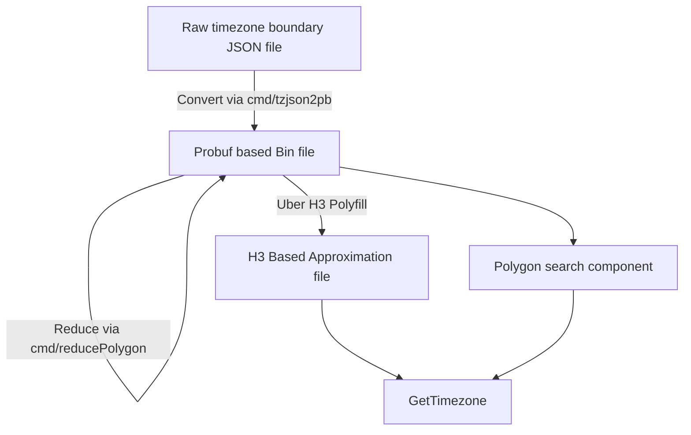

# TZF: a timezone finder for Go.

## Data

Original data download from <https://github.com/evansiroky/timezone-boundary-builder>.

Preprocessed probuf data can get from <https://github.com/ringsaturn/tzf-rel> which has Go's `embed` support.

## TODO

- [x] POC: polygon search based
- [x] Reduce Polygon size option
  - [x] Reduce float precise
  - [x] Reduce line numbers
- [ ] H3 Based Approximation, something like Placekey

## Thanks

- <https://github.com/tidwall/geometry>
- <https://github.com/jannikmi/timezonefinder>
- <https://github.com/evansiroky/timezone-boundary-builder>
